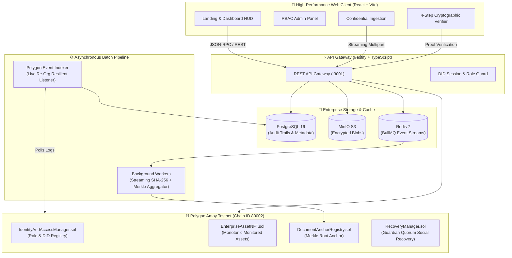

<div align="center">


# ⚡ SECURECHAIN (SIH-26125)
### *Next-Generation Zero-Knowledge Enterprise Identity, Verifiable Asset Ownership & Document Provenance Engine*

[](https://amoy.polygonscan.com)
[](https://soliditylang.org/)
[](https://fastify.dev/)
[](https://vitejs.dev/)
[](https://min.io/)
[](https://redis.io/)
[](https://www.docker.com/)
[](./LICENSE)

<p align="center">
  <b>🔒 Confidential Storage</b> • <b>🌲 SHA-256 Merkle Batches</b> • <b>🛡️ W3C DID PKH</b> • <b>💎 Monotonic ERC-721 Assets</b> • <b>🔑 Social Recovery</b>
</p>

</div>

---

## 🌟 Executive Overview

**SecureChain** is an enterprise-grade trust engine architected to resolve the trilemma between **data privacy**, **cryptographic integrity**, and **regulatory compliance** in critical defense and public-sector operations.

### 🛡️ The Core Problem Solved:
1. **Zero Confidential Bytes On-Chain**: Sensitive enterprise documents are NEVER leaked onto the public blockchain. Original encrypted files remain securely partitioned in private S3/MinIO buckets.
2. **Deterministic Cryptographic Provenance**: Every document ingestion generates an on-the-fly streaming SHA-256 digest, sequenced into an immutable Merkle tree whose root is anchored directly onto Polygon Amoy.
3. **Smart Contract-Enforced RBAC**: Strict separation of concerns ensuring that only verified **ADMIN** principals can mint NFTs and grant roles, while **MANAGERS** and **AUDITORS** operate within cryptographically gated boundary contexts.

---

## 🏗️ System Architecture



---

## 🔐 Smart Contracts Suite

| Contract | Functionality | Invariants Enforced |
| :--- | :--- | :--- |
| **`IdentityAndAccessManager.sol`** | Master W3C DID-to-Wallet registry and RBAC authority matrix. | Only `ADMIN` can grant/revoke roles. Strict 1:1 binding between Ethereum address and DID hash. |
| **`EnterpriseAssetNFT.sol`** | ERC-721 asset tokens representing serialized equipment. | Only `ADMIN` can invoke `mint` and `allocateInitial`. Transfers are policy-controlled. Auditing is strictly read-only. |
| **`DocumentAnchorRegistry.sol`** | Anchors cryptographic Merkle roots of batched document records. | Only authorized accounts can anchor batches. Roots are immutable once sealed. |
| **`RecoveryManager.sol`** | Time-locked guardian recovery protocol for lost enterprise keys. | Quorum threshold required (e.g. 2 of 3 registered guardians) with configurable timelock windows. |

---

## 🔬 4-Step Cryptographic Verification Protocol

Every document anchored in SecureChain undergoes an uncompromising mathematical audit:

```
[1. MINIO RETRIEVAL] ──► [2. STREAMING SHA-256] ──► [3. MERKLE PROOF] ──► [4. POLYGON SCAN]
  Fetch exact bytes         Compute sha256(bytes)       Verify hash against         Match anchored root
  from encrypted S3         against version record     Merkle inclusion path        on Polygon Amoy
```

---

## 🚀 Quickstart & Local Development

### 1. Prerequisites
- **Node.js**: `v20.0.0+`
- **Docker & Docker Compose**: `v24+`
- **MetaMask or Web3 Wallet**: Configured for Polygon Amoy (`Chain ID: 80002`)

### 2. Clone & Install
```bash
git clone https://github.com/bhasitgupta/SIH-26125.git
cd SIH-26125

# Install dependencies across all workspaces
npm install
```

### 3. Launch Local Infrastructure (PostgreSQL, MinIO, Redis)
```bash
npm run infra:up
```
- **MinIO Console**: `http://localhost:9001` (User: `minioadmin` / Pass: `minioadmin`)
- **PostgreSQL**: `localhost:5432` (`sih:sih26125`)
- **Redis**: `localhost:6379`

### 4. Start Development Servers
```bash
# Terminal 1: Run High-Speed Frontend (Vite)
npm run dev

# Terminal 2: Run Microservices Gateway
npm run dev:backend

# Terminal 3: Run Batch Workers & Indexer
npm run dev:workers
npm run dev:indexer
```
- **Frontend HUD**: `http://localhost:5173`
- **Gateway API**: `http://localhost:3001`

---

## 🔑 Initial Admin Wallet Allocation

To grant administrative authority over the contract suite and initial NFT allocation:

```json
{
  "ADMIN_ROLE": [
    "0xf39fd6e51aad88f6f4ce6ab8827279cfffb92266",
    "0x70997970c51812dc3a010c7d01b50e0d17dc79c8"
  ]
}
```
*Tip: Additional admin addresses can be designated directly in the `.env` file or assigned dynamically through the built-in **Access Control (RBAC)** control panel.*

---

## 📦 Monorepo Structure

```
SIH-26125/
├── contracts/               # Solidity 0.8.20 Smart Contracts
│   ├── src/                 # Core contract implementations
│   └── script/              # Deployment automation scripts
├── frontend/                # Ultra-Responsive Cyberpunk React SPA (Vite)
│   ├── src/pages/           # Dashboard, RBAC, Assets, Verification, Documents
│   ├── src/components/      # Reusable HUD elements & Animated Borders
│   └── src/lib/api.js       # Fastify Gateway integration client
├── services/
│   ├── gateway/             # Fastify REST microservice API
│   ├── indexer/             # Real-time Polygon blockchain log listener
│   └── workers/             # Asynchronous streaming Merkle batch processor
├── packages/
│   ├── common/              # Shared schemas, DIDs, and TypeScript types
│   ├── contracts/           # Generated typed contract ABIs
│   └── merkle/              # High-throughput Merkle tree algorithms
└── infra/                   # Docker Compose & container configurations
```

---

<div align="center">
  <sub>Built with 💜 for Smart India Hackathon (SIH-26125) • Secured by Polygon Amoy</sub>
</div>
